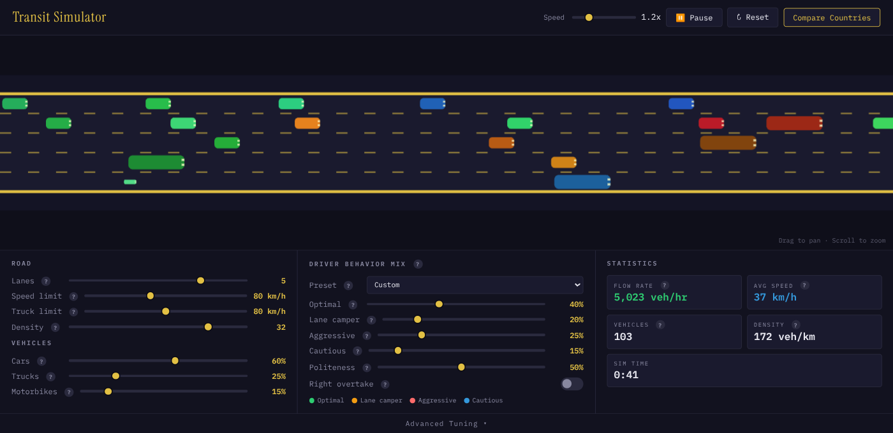

# Transit Simulator

A real-time traffic simulation that models multi-lane highway dynamics with realistic driver behaviors. Watch how different driving cultures, vehicle mixes, and road configurations affect traffic flow — from smooth cruising to phantom traffic jams.

**[Live Demo](https://iloire.github.io/transit-simulator/)**



## Features

- **Realistic physics** — Car-following via the Intelligent Driver Model (IDM) and lane-changing via MOBIL
- **Driver personalities** — Optimal, Lane Camper, Aggressive, and Cautious drivers with tunable parameters
- **Country presets** — Load driving culture profiles for Germany, Japan, Italy, India, USA, and more
- **Vehicle types** — Cars, trucks, and motorbikes with distinct size, speed, and acceleration characteristics
- **Live statistics** — Flow rate, average speed, density, and vehicle count updated in real time
- **Comparison mode** — Run multiple country presets side-by-side to compare traffic dynamics
- **Advanced tuning** — Full control over IDM and MOBIL parameters per driver profile
- **Interactive canvas** — Drag to pan, scroll to zoom, pause/reset at any time

## Getting Started

```bash
npm start
```

Opens a local server at [http://localhost:3000](http://localhost:3000).

No build step — the app is vanilla HTML, CSS, and ES modules.

## Controls

| Section | What it does |
|---|---|
| **Road** | Lanes, speed limit, truck limit, traffic density |
| **Vehicles** | Car / truck / motorbike ratio |
| **Driver Behavior Mix** | Optimal / lane camper / aggressive / cautious weights, politeness, right-overtake toggle |
| **Country Preset** | One-click driving culture (Germany, Japan, USA, Italy, etc.) |
| **Advanced Tuning** | Per-profile IDM & MOBIL parameters (speed factor, headway, acceleration, lane bias, etc.) |
| **Statistics** | Flow rate, avg speed, vehicle count, density, sim time |

## How It Works

The simulation uses two well-known traffic models:

- **IDM (Intelligent Driver Model)** — Governs acceleration and braking based on desired speed, following distance, and approach velocity
- **MOBIL (Minimizing Overall Braking Induced by Lane changes)** — Decides when a lane change is safe and beneficial, factoring in politeness and the impact on surrounding drivers

The road is toroidal (vehicles wrap around), so you can observe steady-state traffic patterns without edge effects.

## License

MIT
